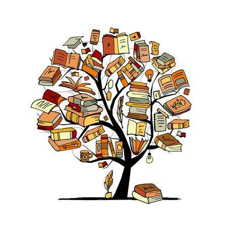

% Introducción a la Literatura Comparada
% Diego Jiménez Avendaño
% Mayo de 2024

# Introducción

## ¿Por qué este curso?

* Este curso ofrece una visión introductoria a la literatura comparada, una disciplina que explora las conexiones y contrastes entre obras literarias de diferentes épocas, culturas y contextos. 

\centering

{ width=20% }\ 

# Literatura Comparada: Conceptos y Objetivos

## Objetivos del curso

Los estudiantes entenderán la importancia de la comparación literaria para ampliar su comprensión del mundo y desarrollarán habilidades críticas para analizar textos literarios desde diferentes perspectivas.

# Teorías y Enfoques en Literatura Comparada

## Enfoques teóricos

Se presentarán diferentes enfoques teóricos utilizados en la literatura comparada, como el formalismo, el estructuralismo y el poscolonialismo. Estos enfoques proporcionarán herramientas analíticas para el estudio comparativo de obras literarias.

# Comparación de Estilos y Movimientos Literarios

## Relación entre movimientos literarios

Esta sección explorará cómo se relacionan y difieren diferentes movimientos literarios a través de ejemplos concretos. Se utilizarán presentaciones interactivas para comparar dos movimientos literarios relevantes.

# Perspectivas Culturales y Sociales en la Literatura

## Reflexión sobre contextos culturales y sociales

En esta sección, se explorará cómo las obras literarias reflejan y comentan aspectos culturales y sociales de sus respectivas épocas y contextos. Se presentará un informe sobre la influencia de factores culturales y sociales en la producción literaria.

# Conclusiones y Reflexiones

## Recapitulación y reflexión

Se resumirán los temas principales tratados en el curso y se proporcionará un espacio para que los estudiantes reflexionen sobre lo aprendido y cómo pueden aplicar los conceptos de literatura comparada en su propio análisis literario.

# Recursos Adicionales y Bibliografía

## Ampliación de conocimientos

Se recopilarán recursos adicionales para aquellos interesados en profundizar en el tema, junto con una lista de lecturas recomendadas y bibliografía consultada para el curso.
