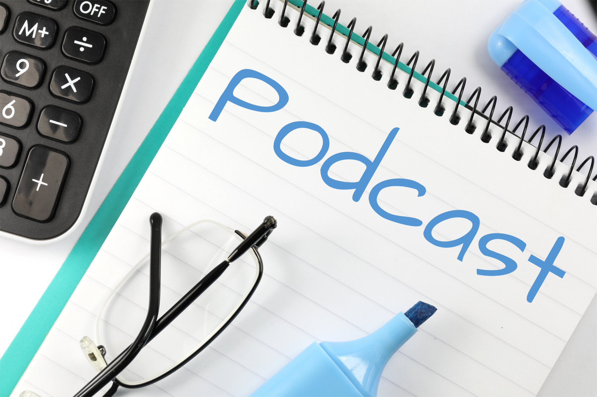

% Accesibilidad de los podcasts
% Diego Jiménez Avendaño
% Febrero 2024

# Introducción al concepto de "podcast"

## ¿Qué es un podcast? 

* Es un formato de contenido digital que consiste en episodios de audio, video o texto, generalmente centrados en un tema específico. Suelen ser producidos de manera regular y **están disponibles para su descarga o transmisión en línea**, y los usuarios pueden suscribirse a ellos.

\centering

{width=30%}\ 

## Uso de podcasts como Recursos Educativos Abiertos (REA)

* Los podcasts pueden emplearse en diversos tipos de cursos y dirigirse a diferentes usuarios y estudiantes, ya sea para fomentar el autoaprendizaje o reforzar conceptos impartidos en clase.
* **Es fundamental garantizar la accesibilidad al incorporar podcasts en tus REA**. Esto ampliará tu audiencia de forma significativa.

## Motivos por los que hacer accesible tu podcast

1. Asegurar la disponibilidad del contenido para personas con discapacidad auditiva.
2. Mejorar la exposición y alcance de tu contenido.
3. No solo afecta a personas con discapacidad auditiva; también es necesario considerar:
	- Discapacidades cognitivas
	- Hablantes no nativos
	- Personas en entornos que desfavorables para la escucha.

## Consideraciones para mejorar la accesibilidad en tu podcast
* Al crear un podcast, es importante tener en cuenta las siguientes características:
	- Incluye transcripciones en tus programas.
	- Asegúrate de que tu sitio web sea accesible.
	- Selecciona un reproductor multimedia que sea accesible.

# Transcripciones 

## Beneficios del uso de podcasts

* Incluir transcripciones en tus podcasts es la medida más esencial y fundamental para mejorar la accesibilidad de tu contenido.
* Las transcripciones benefician a diversos usuarios, no solo a aquellos con discapacidades.
* Ofrecen una manera efectiva de buscar contenido específico dentro de los podcasts.
* Muchos usuarios pueden preferir escuchar mientras siguen leyendo la transcripción.

## Métodos para crear y visualizar transcripciones

1. Creación manual: Económico, preciso y rápido, aunque puede ser laborioso.
2. Transcripción automática: Asequible y rápida, pero con menor precisión. 
3. Servicios de transcripción humana: Ofrecen alta precisión, aunque los costos y tiempos de entrega pueden ser más elevados.
	
## Modos de presentación de transcripciones 

Si decides proporcionar transcripciones, **asegúrate de mencionarlo en la introducción del episodio**. A continuación, se presentan algunos ejemplos de transcripciones con enlaces incorporados.

* [Texto sin formato o HTML](https://a11yrules.com/podcast/gaad-2018-special/)
* [Archivo descargable o transcripción enlazada](http://5by5.tv/bigwebshow/176)
* [Transcripción sincronizada](https://gretta.com/hanselminutes/)

# Página web

## Elementos para mejorar la accesibilidad en la web

* Los elementos interactivos  son accesibles y se pueden activar solo con el teclado.
* Compatible con lectores de pantalla.
* Contraste de colores equilibrado para facilitar la lectura.
* El texto es escalable hasta al menos un 200% y sigue siendo legible.
* Las imágenes informativas incluyen textos alternativos descriptivos.

# Reproductor multimedia 

## Selección del reproductor multimedia
* La elección del reproductor multimedia puede determinar si las personas con discapacidad pueden utilizarlo o no.
	- Se espera, como mínimo, que sea operable únicamente con el teclado.
	- El enfoque debe ser visible en cada control. 
	- Los controles deben estar claramente etiquetados para que un lector de pantalla pueda comprenderlos y anunciarlos de manera precisa.

## Funciones fundamentales de accesibilidad en reproductores multimedia
- Todos los controles son accesibles y pueden activarse mediante el teclado.
- Todos los controles son visibles.
- Las etiquetas de cada control son claras y están disponibles para los lectores de pantalla.
- El contenido multimedia no se reproduce automáticamente.

## Funcionalidades avanzadas de accesibilidad en reproductores multimedia

- Capacidad para incluir transcripciones sincronizadas.
- Posibilidad de agregar vídeo descriptivo (para archivos de vídeo).
- Capacidad para mostrar/ocultar subtítulos (para archivos de vídeo).

## Algunos reproductores multimedia accesibles
- *AblePlayer*: [Link de acceso](https://ableplayer.github.io/ableplayer/)
- *JW Player*: [Link de acceso](https://jwplayer.com/)
- *YouTube Media Player* (versión HTML5) 

